# BLAKE

Modern hash functions that are faster than SHA2 while having better security. If you are starting fresh and do not need SHA2 compatibility, BLAKE3 is probably what you want.

## BLAKE2b

```luau
local Blake2b = Cryptography.Hashing.Blake2b
```

### `Blake2b(InputData: buffer, OutputLength: number?, KeyData: buffer?) -> (string, buffer)`

BLAKE2b with optional output length and optional key for keyed hashing.

```luau
-- Simple hash (default 64 byte output)
local HexDigest, RawDigest = Blake2b(buffer.fromstring("Hello"))
print(buffer.len(RawDigest)) -- 64

-- Custom output length
local ShortHex, ShortRaw = Blake2b(buffer.fromstring("data"), 32)
print(buffer.len(ShortRaw)) -- 32

-- Keyed hash (works as a MAC)
local Key = buffer.fromstring("my-secret-key-32-bytes-long!!!!!")
local KeyedHex, KeyedRaw = Blake2b(buffer.fromstring("message"), 64, Key)
```

BLAKE2b is faster than MD5 while being as secure as SHA3. The keyed mode is built into the algorithm, making it simpler and faster than HMAC for MAC use cases. It uses a modified ChaCha permutation internally.

## BLAKE3

```luau
local Blake3 = Cryptography.Hashing.Blake3
```

BLAKE3 is the latest iteration. Parallelizable, faster than BLAKE2, and extremely versatile with three modes.

### `Blake3.Digest(Message: buffer, Length: number?) -> (string, buffer)`

Standard hashing. Returns hex string and raw buffer.

```luau
local HexDigest, RawDigest = Blake3.Digest(buffer.fromstring("Hello World"), 32)
print(HexDigest) -- hex string
print(buffer.len(RawDigest)) -- 32
```

### `Blake3.DigestKeyed(Message: buffer, Key: buffer, Length: number?) -> (string, buffer)`

Keyed hash mode for MACs. Key must be exactly 32 bytes.

```luau
local Key = CSPRNG.RandomBytes(32)
local HexMac, RawMac = Blake3.DigestKeyed(buffer.fromstring("message"), Key, 32)
```

This is faster than HMAC and just as secure. The key is mixed into the initialization vector rather than processed through the compression function twice like HMAC.

### `Blake3.DeriveKey(Context: buffer) -> (Message: buffer, Length: number?) -> (string, buffer)`

Key derivation mode. Returns a function that derives keys from input material.

```luau
local Context = buffer.fromstring("MyApp 2024 session key")
local KeyDeriver = Blake3.DeriveKey(Context)

local MasterSecret = buffer.fromstring("shared secret from key exchange")

-- Derive an encryption key
local EncKeyHex, EncKeyRaw = KeyDeriver(MasterSecret, 32)

-- Derive a different key with different context
local MacContext = buffer.fromstring("MyApp 2024 mac key")
local MacDeriver = Blake3.DeriveKey(MacContext)
local MacKeyHex, MacKeyRaw = MacDeriver(MasterSecret, 32)
```



```mermaid
flowchart LR
    MS[Master Secret] --> D1[DeriveKey]
    MS --> D2[DeriveKey]
    MS --> D3[DeriveKey]
    
    C1[Context: encryption] --> D1
    C2[Context: mac] --> D2
    C3[Context: auth] --> D3
    
    D1 --> EK[Encryption Key]
    D2 --> MK[MAC Key]
    D3 --> AK[Auth Key]
    
    style MS fill:#3c5a3c
    style C1 fill:#3c3c5a
    style C2 fill:#3c3c5a
    style C3 fill:#3c3c5a
    style D1 fill:#503c50
    style D2 fill:#503c50
    style D3 fill:#503c50
    style EK fill:#5a4632
    style MK fill:#5a4632
    style AK fill:#5a4632
```

The context string ensures that keys derived for different purposes are cryptographically independent, even from the same master secret. This is cleaner than concatenating purpose strings to your key material.

BLAKE3 uses a Merkle tree structure internally with 1024 byte chunks. The compression function is similar to BLAKE2s but uses permuted message words between rounds instead of a fixed schedule. The tree structure means it can be parallelized, though in single threaded Luau you will not see that benefit.
