# ML DSA (Post Quantum Signatures)

Module Lattice Digital Signature Algorithm. This is the NIST post quantum signature standard, formerly known as Dilithium. Use this when you need signatures that will remain secure even against quantum computers.
```luau
local Mldsa = Cryptography.Verification.Mldsa
```

## Security Levels

Three variants with increasing security (and size):

| Variant | Security | Public Key | Secret Key | Signature |
|---------|----------|------------|------------|-----------|
| ML_DSA_44 | AES 128 equivalent | 1,312 bytes | 2,560 bytes | 2,420 bytes |
| ML_DSA_65 | AES 192 equivalent | 1,952 bytes | 4,032 bytes | 3,309 bytes |
| ML_DSA_87 | AES 256 equivalent | 2,592 bytes | 4,896 bytes | 4,627 bytes |

Compare to Ed25519's 32 byte keys and 64 byte signatures. The size increase is the price of quantum resistance.

## Key Generation

### `ML_DSA_44.GenerateKeys() -> (buffer, buffer)`
### `ML_DSA_65.GenerateKeys() -> (buffer, buffer)`
### `ML_DSA_87.GenerateKeys() -> (buffer, buffer)`

Generates a keypair. Returns (PublicKey, SecretKey).
```luau
local PublicKey, SecretKey = Mldsa.ML_DSA_65.GenerateKeys()
```

## Signing

### `ML_DSA_44.Sign(Message: buffer, RandomSeed: buffer, SecretKey: buffer, Context: buffer, Signature: buffer) -> boolean`
### `ML_DSA_65.Sign(Message: buffer, RandomSeed: buffer, SecretKey: buffer, Context: buffer, Signature: buffer) -> boolean`
### `ML_DSA_87.Sign(Message: buffer, RandomSeed: buffer, SecretKey: buffer, Context: buffer, Signature: buffer) -> boolean`

Signs a message. You provide the signature buffer to write into. Returns true on success.
```luau
local Message = buffer.fromstring("Important document")
local RandomSeed = CSPRNG.RandomBytes(32)
local Context = buffer.fromstring("my application context")
local Signature = buffer.create(Mldsa.ML_DSA_65.SigByteLen)

local Success = Mldsa.ML_DSA_65.Sign(Message, RandomSeed, SecretKey, Context, Signature)
if Success then
    print("Signed successfully")
end
```

**Parameters:**
- `Message`: The data to sign
- `RandomSeed`: 32 bytes of randomness for hedged signing
- `SecretKey`: Your secret key from GenerateKeys
- `Context`: Application specific context string (can be empty buffer)
- `Signature`: Pre allocated buffer to write signature into (use `SigByteLen` for size)

## Verification

### `ML_DSA_44.Verify(Message: buffer, PublicKey: buffer, Context: buffer, Signature: buffer) -> boolean`
### `ML_DSA_65.Verify(Message: buffer, PublicKey: buffer, Context: buffer, Signature: buffer) -> boolean`
### `ML_DSA_87.Verify(Message: buffer, PublicKey: buffer, Context: buffer, Signature: buffer) -> boolean`

Returns `true` if the signature is valid.
```luau
local IsValid = Mldsa.ML_DSA_65.Verify(Message, PublicKey, Context, Signature)
if IsValid then
    print("Signature verified")
end
```

The context must match what was used during signing.

## Size Constants

Each variant exposes size constants so you do not need to remember exact byte lengths:
```luau
-- ML_DSA_44
Mldsa.ML_DSA_44.SigByteLen   -- signature size
Mldsa.ML_DSA_44.PKByteLen    -- public key size
Mldsa.ML_DSA_44.SKByteLen    -- secret key size

-- ML_DSA_65
Mldsa.ML_DSA_65.SigByteLen
Mldsa.ML_DSA_65.PKByteLen
Mldsa.ML_DSA_65.SKByteLen

-- ML_DSA_87
Mldsa.ML_DSA_87.SigByteLen
Mldsa.ML_DSA_87.PKByteLen
Mldsa.ML_DSA_87.SKByteLen
```

## How It Works

ML DSA is based on the hardness of the Module Learning With Errors (M LWE) and Module Short Integer Solution (M SIS) problems. These are believed to be hard even for quantum computers.

The implementation uses Number Theoretic Transform (NTT) for fast polynomial multiplication, rejection sampling during signature generation, and SHAKE256 for internal hashing and randomness expansion.

Signature generation involves some rejection sampling, so signing time can vary slightly. Verification is deterministic and consistent.

## When to Use ML DSA

**Use ML DSA when:**
- You are protecting data that needs to remain secure for decades
- Regulatory requirements mandate post quantum cryptography
- You are building infrastructure that cannot be easily updated later
- Harvest now, decrypt later attacks are a concern for your threat model

**Stick with Ed25519 when:**
- Key and signature size matter (ML DSA is 40 to 70x larger)
- You need maximum performance
- Your data does not need multi decade protection
- You can migrate to post quantum later when needed

## Examples
```luau
-- Signer generates keypair
local PublicKey, SecretKey = Mldsa.ML_DSA_65.GenerateKeys()

-- Signer signs a message
local Message = buffer.fromstring("Important document")
local RandomSeed = CSPRNG.RandomBytes(32)
local Context = buffer.fromstring("my app")
local Signature = buffer.create(Mldsa.ML_DSA_65.SigByteLen)

Mldsa.ML_DSA_65.Sign(Message, RandomSeed, SecretKey, Context, Signature)

-- Send: Message, Signature, PublicKey

-- Verifier checks signature
local IsValid = Mldsa.ML_DSA_65.Verify(Message, PublicKey, Context, Signature)
```

```mermaid
flowchart LR
    subgraph Signer
        Gen[GenerateKeys] --> SK[SecretKey]
        Gen --> PK[PublicKey]
        Msg[Message] --> Sign
        SK --> Sign
        Sign --> Sig[Signature]
    end
    
    Msg & Sig & PK -->|Send| Verify
    
    subgraph Verifier
        Verify --> Valid
    end
    
    style Gen fill:#3c5a3c
    style SK fill:#3c5a3c
    style PK fill:#3c5a3c
    style Msg fill:#3c3c5a
    style Sign fill:#503c50
    style Sig fill:#5a4632
    style Verify fill:#503c50
    style Valid fill:#2a5a2a
```

### Hybrid Approach

For maximum security, combine classical and post quantum signatures:
```luau
-- Sign with both algorithms
local Ed25519Sig = EdDSA.Sign(Message, EdSecret, EdPublic)

local MlDsaSig = buffer.create(Mldsa.ML_DSA_65.SigByteLen)
Mldsa.ML_DSA_65.Sign(Message, CSPRNG.RandomBytes(32), MlDsaSecret, Context, MlDsaSig)

-- Verify both
local Valid = EdDSA.Verify(Message, EdPublic, Ed25519Sig)
    and Mldsa.ML_DSA_65.Verify(Message, MlDsaPublic, Context, MlDsaSig)
```

This protects against classical attacks (via ML DSA), potential weaknesses in lattice cryptography (via Ed25519), and unknown attacks on either scheme.

The downside is doubled signature size and verification time.

## Performance Considerations

ML DSA is significantly slower than Ed25519. Key generation is around 10 to 50x slower, signing is around 5 to 20x slower (with rejection sampling variance), and verification is around 5 to 10x slower.

The exact ratios depend on the security level and message size. For most applications this is still fast enough, but do not use ML DSA in tight loops or high frequency signing scenarios without benchmarking.