# ML KEM (Post Quantum Key Exchange)

Module Lattice Key Encapsulation Mechanism. This is the NIST post quantum key exchange standard, formerly known as Kyber. Use this to establish shared secrets that will remain secure against quantum computers.

```luau
local MlKem = Cryptography.Verification.MlKem
```

## Security Levels

| Variant | Security | Public Key | Secret Key | Ciphertext | Shared Secret |
|---------|----------|------------|------------|------------|---------------|
| MLKEM_512 | AES 128 equivalent | 800 bytes | 1,632 bytes | 768 bytes | 32 bytes |
| MLKEM_768 | AES 192 equivalent | 1,184 bytes | 2,400 bytes | 1,088 bytes | 32 bytes |
| MLKEM_1024 | AES 256 equivalent | 1,568 bytes | 3,168 bytes | 1,568 bytes | 32 bytes |

Compare to X25519's 32 byte keys and no ciphertext (just public key exchange).

## Key Generation

### `MLKEM_512.GenerateKeys() -> (buffer, buffer)`
### `MLKEM_768.GenerateKeys() -> (buffer, buffer)`
### `MLKEM_1024.GenerateKeys() -> (buffer, buffer)`

Generates an encapsulation keypair. Returns (PublicKey, SecretKey).

```luau
local PublicKey, SecretKey = MlKem.MLKEM_768.GenerateKeys()
```

### `MLKEM_512.KeyGen(D: buffer, Z: buffer) -> (buffer, buffer)`
### `MLKEM_768.KeyGen(D: buffer, Z: buffer) -> (buffer, buffer)`
### `MLKEM_1024.KeyGen(D: buffer, Z: buffer) -> (buffer, buffer)`

Deterministic key generation from seed values.

```luau
local D = CSPRNG.RandomBytes(32)
local Z = CSPRNG.RandomBytes(32)
local PublicKey, SecretKey = MlKem.MLKEM_768.KeyGen(D, Z)
```

## Encapsulation

### `MLKEM_512.Encapsulate(Message: buffer, PublicKey: buffer) -> (buffer?, buffer?)`
### `MLKEM_768.Encapsulate(Message: buffer, PublicKey: buffer) -> (buffer?, buffer?)`
### `MLKEM_1024.Encapsulate(Message: buffer, PublicKey: buffer) -> (buffer?, buffer?)`

Creates a ciphertext and shared secret using the recipient's public key.

```luau
local Message = CSPRNG.RandomBytes(32)
local Ciphertext, SharedSecret = MlKem.MLKEM_768.Encapsulate(Message, RecipientPublicKey)
if Ciphertext and SharedSecret then
    -- Send Ciphertext to recipient
    -- Use SharedSecret for encryption
    print(buffer.len(SharedSecret)) -- 32
end
```

Returns `nil, nil` if the public key is invalid.

## Decapsulation

### `MLKEM_512.Decapsulate(Ciphertext: buffer, SecretKey: buffer) -> buffer`
### `MLKEM_768.Decapsulate(Ciphertext: buffer, SecretKey: buffer) -> buffer`
### `MLKEM_1024.Decapsulate(Ciphertext: buffer, SecretKey: buffer) -> buffer`

Recovers the shared secret using the secret key.

```luau
local SharedSecret = MlKem.MLKEM_768.Decapsulate(Ciphertext, SecretKey)
print(buffer.len(SharedSecret)) -- 32

-- SharedSecret matches what Encapsulate produced
```

## KEM vs DH

Key Encapsulation Mechanisms work differently than Diffie Hellman:

**Diffie Hellman (X25519)**
1. Alice and Bob exchange public keys
2. Both compute the same shared secret independently
3. Symmetric: either party can initiate

**KEM (ML KEM)**
1. Bob publishes his public key
2. Alice generates a random message and encapsulates it for Bob
3. Alice sends the ciphertext to Bob
4. Bob decapsulates to recover the shared secret
5. Asymmetric: Alice initiates, Bob receives

The KEM model maps naturally to how most protocols work anyway (client initiates connection to server).

## How It Works

ML KEM is based on the hardness of the Module Learning With Errors (M LWE) problem. The encapsulation process generates a random message, encrypts it using the public key via a lattice based encryption scheme, and derives the final shared secret.

The decapsulation process decrypts the ciphertext using the secret key, re encrypts the decrypted message and checks it matches, and if valid derives the shared secret the same way. If invalid, it derives a pseudorandom value (prevents leaking information about failures).

This re encryption check is an implicit rejection mechanism that provides IND CCA2 security.

## Examples
```luau
-- Receiver generates keypair
local PublicKey, SecretKey = MlKem.MLKEM_768.GenerateKeys()

-- Sender encapsulates a shared secret
local Message = CSPRNG.RandomBytes(32)
local Ciphertext, SharedSecret = MlKem.MLKEM_768.Encapsulate(Message, PublicKey)

-- Sender encrypts data with shared secret
local Nonce = CSPRNG.RandomBytes(12)
local EncryptedData, Tag = AEAD.Encrypt(Data, SharedSecret, Nonce)

-- Send: Ciphertext, Nonce, EncryptedData, Tag

-- Receiver decapsulates to get same shared secret
local SharedSecret = MlKem.MLKEM_768.Decapsulate(Ciphertext, SecretKey)

-- Receiver decrypts data
local Data = AEAD.Decrypt(EncryptedData, SharedSecret, Nonce, Tag)
```



```mermaid
flowchart LR
    subgraph Receiver
        Gen[GenerateKeys] --> PK[PublicKey]
        Gen --> SK[SecretKey]
    end
    
    PK --> Enc
    
    subgraph Sender
        Enc[Encapsulate] --> SS1[SharedSecret]
        Enc --> CT[Ciphertext]
        SS1 --> E[Encrypt]
    end
    
    CT --> Dec
    SK --> Dec
    
    subgraph Receiver2[" "]
        Dec[Decapsulate] --> SS2[SharedSecret]
        SS2 --> D[Decrypt]
    end
    
    style Gen fill:#3c5a3c
    style PK fill:#3c5a3c
    style SK fill:#3c5a3c
    style Enc fill:#3c3c5a
    style SS1 fill:#3c3c5a
    style CT fill:#5a4632
    style E fill:#503c50
    style Dec fill:#3c5a3c
    style SS2 fill:#3c5a3c
    style D fill:#2a5a2a
```

### Hybrid Key Exchange

Combine ML KEM with X25519 for defense in depth:

```luau
-- Both parties have X25519 and ML KEM keys

-- Classical X25519 exchange
local X25519Shared1, _ = X25519.Exchange(MyMaskedKey, TheirX25519Public)

-- Post quantum ML KEM exchange (initiator side)
local KemMessage = CSPRNG.RandomBytes(32)
local KemCiphertext, KemSecret = MlKem.MLKEM_768.Encapsulate(KemMessage, TheirMlKemPublic)

-- Combine both secrets
local CombinedInput = buffer.create(64)
buffer.copy(CombinedInput, 0, X25519Shared1)
buffer.copy(CombinedInput, 32, KemSecret)

local Context = buffer.fromstring("hybrid key exchange")
local FinalDeriver = Blake3.DeriveKey(Context)
local _, FinalKey = FinalDeriver(CombinedInput, 32)
```

The responder side:

```luau
local X25519Shared1, _ = X25519.Exchange(MyMaskedKey, TheirX25519Public)
local KemSecret = MlKem.MLKEM_768.Decapsulate(KemCiphertext, MyMlKemSecret)

local CombinedInput = buffer.create(64)
buffer.copy(CombinedInput, 0, X25519Shared1)
buffer.copy(CombinedInput, 32, KemSecret)

local Context = buffer.fromstring("hybrid key exchange")
local FinalDeriver = Blake3.DeriveKey(Context)
local _, FinalKey = FinalDeriver(CombinedInput, 32)
```

This protects against classical attacks (via ML KEM) and potential weaknesses in lattice cryptography (via X25519).

```mermaid
flowchart LR
    subgraph Initiator
        X1[X25519.Exchange] --> S1[X25519Shared]
        KM[RandomBytes] --> Enc[ML KEM Encapsulate]
        Enc --> KS1[KemSecret]
        Enc --> CT[Ciphertext]
    end
    
    CT -->|Send| Dec
    
    subgraph Responder
        X2[X25519.Exchange] --> S2[X25519Shared]
        Dec[ML KEM Decapsulate] --> KS2[KemSecret]
    end
    
    subgraph Combine["Key Derivation"]
        S1 --> C1[Combine 64 bytes]
        KS1 --> C1
        C1 --> B1[Blake3.DeriveKey]
        B1 --> FK1[FinalKey]
        
        S2 --> C2[Combine 64 bytes]
        KS2 --> C2
        C2 --> B2[Blake3.DeriveKey]
        B2 --> FK2[FinalKey]
    end
    
    FK1 -.- Same[Same Key]
    FK2 -.- Same
    
    style X1 fill:#3c3c5a
    style S1 fill:#3c3c5a
    style KM fill:#3c5a3c
    style Enc fill:#3c5a3c
    style KS1 fill:#3c5a3c
    style CT fill:#5a4632
    style X2 fill:#3c3c5a
    style S2 fill:#3c3c5a
    style Dec fill:#3c5a3c
    style KS2 fill:#3c5a3c
    style C1 fill:#503c50
    style C2 fill:#503c50
    style B1 fill:#503c50
    style B2 fill:#503c50
    style FK1 fill:#5a5a32
    style FK2 fill:#5a5a32
    style Same fill:#2a5a2a
```



## When to Use ML KEM

**Use ML KEM when:**
- You need key exchange that survives quantum computers
- Harvest now, decrypt later is a concern
- Regulatory requirements mandate post quantum crypto
- You are building long lived infrastructure

**Stick with X25519 when:**
- Bandwidth is constrained (ML KEM ciphertexts are 768 to 1568 bytes)
- Performance is critical
- You can migrate to post quantum later

## Performance Notes

ML KEM is faster than X25519.

The bigger concern is typically bandwidth rather than computation. Make sure your protocol can handle the larger key and ciphertext sizes.
